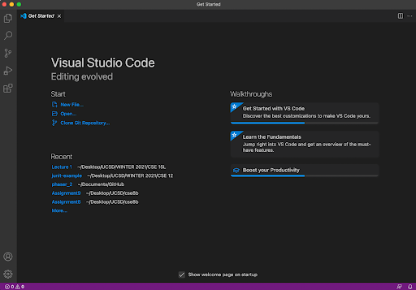
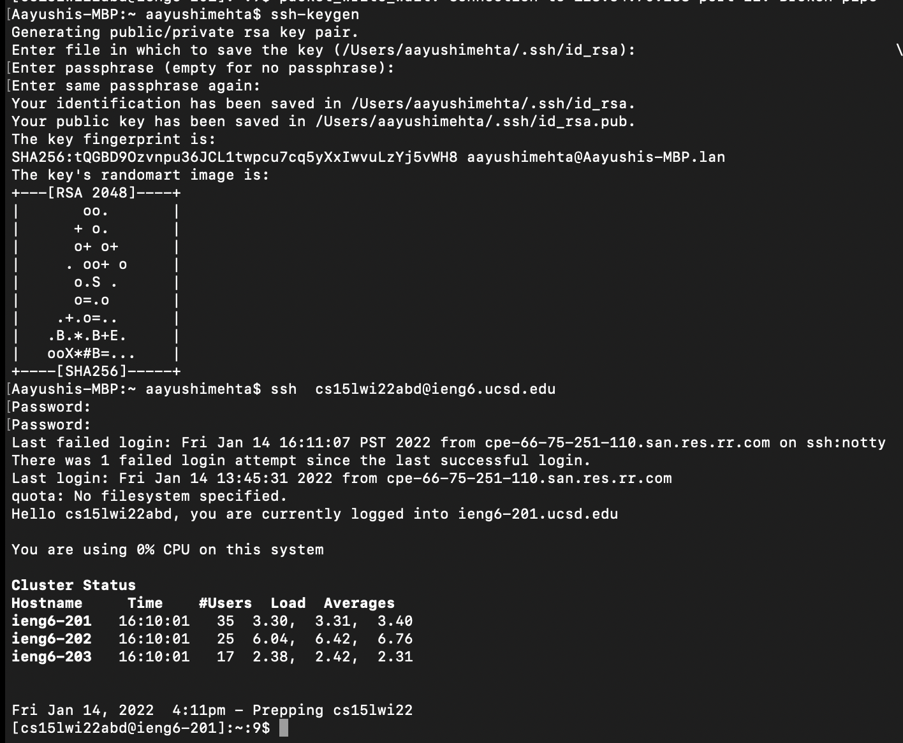

# Aayushi's Lab 2
## Tutorial on how to log onto a course specfic account
1. [Install VS Code]( https://code.visualstudio.com)

2. Remotely Connecting
* install a program called OpenSSH, which is a program that can connect your computer to other computers that have this kind of account:
[Install OpenSSH](https://docs.microsoft.com/en-us/windows-server/administration/openssh/openssh_install_firstuse)
* Then, look up your course-specific account for CSE15L here:
[Course-Specific Account Website](https://sdacs.ucsd.edu/~icc/index.php)

3. Run Some Commands
There are a few important commands to learn when using git. A few examples are cd which allows you to change your directory, ls which allows you to see the files in your current directory and mkdir which allows you to make a new directory. Try out these commands and see what they do!
* ```cd ~```
* ```cd```
* ```ls -lat```
```ls -a```
* ```ls <directory> where <directory> is /home/linux/ieng6/cs15lwi22/cs15lwi22abc, where the abc is one of the other group members’ username```
* ```cp /home/linux/ieng6/cs15lwi22/public/hello.txt ~/```
* ```cat /home/linux/ieng6/cs15lwi22/public/hello.txt```

 4. Moving files over SSH with scp. Make a file in your main directory and then copy using scp into your ssh directory. Then ssh into your account and check if your image is there!

 5. SSH Keys  
 Next step is to make it a little easier to login. Instead of putting in your password everytime we can use SSH Keys.
 The steps to do this are: 
 * Use the command ssh-keygen to generate an ssh key
 * enter /Users/joe/.ssh/id_rsa for a file to save the key
 * you will be asked to eneter passphrase after logging in, make sure to enter without typing anything
 * Finally SSH into your course specific account
 
 6. Making remote running even more pleasant
 * By using some new commands we can make this process even easier
 * One really useful edit is adding semicolons to run multiple commands on the same line in most terminals
 * Another is adding commands in quotes after ssh'ing to run it directly on the server and exit 


7. One way to optomize is to use less keystrokes. A way we can do that is when we want to repeat a command we can put ```^``` . This will go through the previous commands and we can keep hitting up till we get to the one we want. This saves us the keystrokes of retyping the whole code.
 
 
 
  
  
