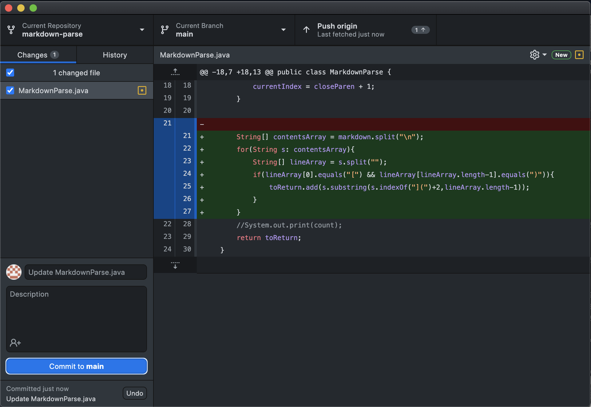
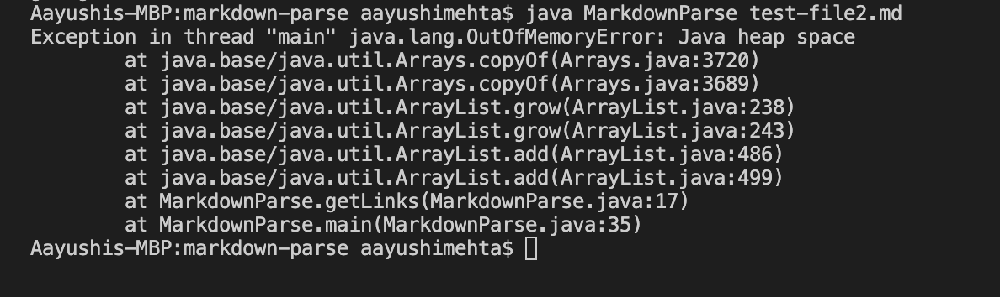
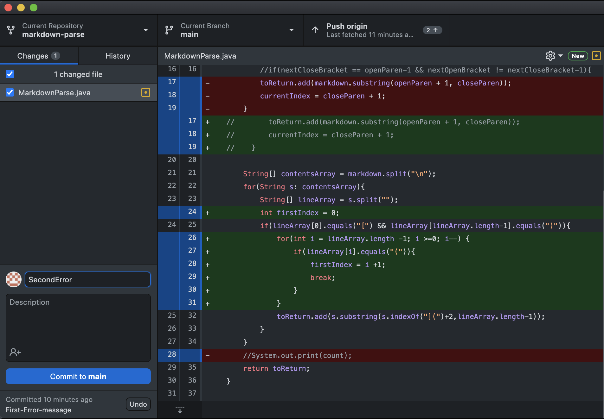
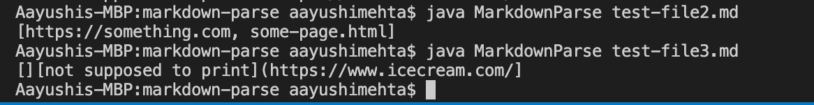
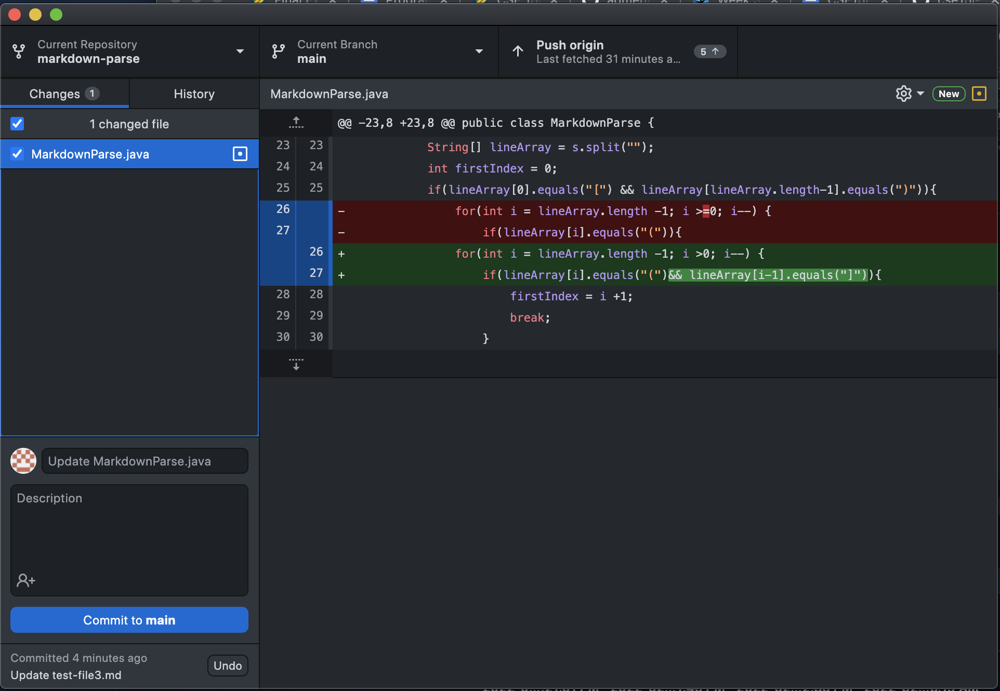
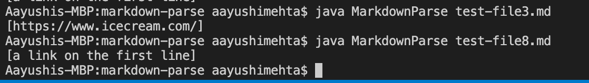

# Aayushi's Lab Report 2
## Three failure-inducing input's and symptoms
## 1. First Error
* Code Change: 
* Failure Inducing Input: [TestFile2](https://github.com/agmehta1/cse15l-lab-reports/blob/main/test-file2.md)
* Symptom: 
* Relationship between bug, symptom and failure-inducing input: The bug was an infinite loop caused by a pair of parenthesis in a line. The file(failure-inducing-input) had these parenthesis in the middle of the brackets causing such an error. This is shown by the symptom of a java heap space error which indicates the infinite loop
Write 2-3 sentences describing the relationship between the bug, the symptom, and the failure-inducing input.

## 2. Second Error
* Code Change: 
* Failure Inducing Input: [TestFile3](https://github.com/agmehta1/cse15l-lab-reports/blob/main/test-file3.md)
* Symptom: 
* Relationship between bug, symptom and failure-inducing input: After editing it to fix the first error as shown in the code change above, we now have a bug where after the first ```](``` it would start the link. The file(failure-inducing-input) has the line: ```[](][not supposed to print](https://www.icecream.com/)``` and the bug is that everything after the first ```](``` is included in the link. So the text and brackets ```][not supposed to print]``` were outputed when they shouldn't have been.

## 3. Third Error
* Code Change: 
* Failure Inducing Input: [TestFile2](https://github.com/agmehta1/cse15l-lab-reports/blob/main/test-file8.md)
* Symptom: 
*
