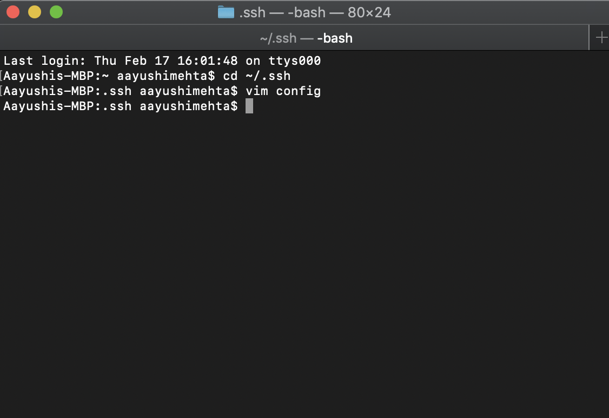
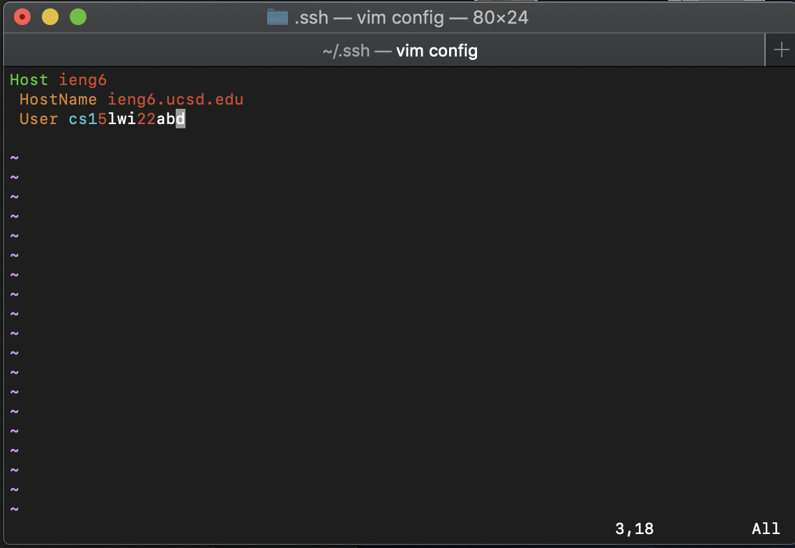
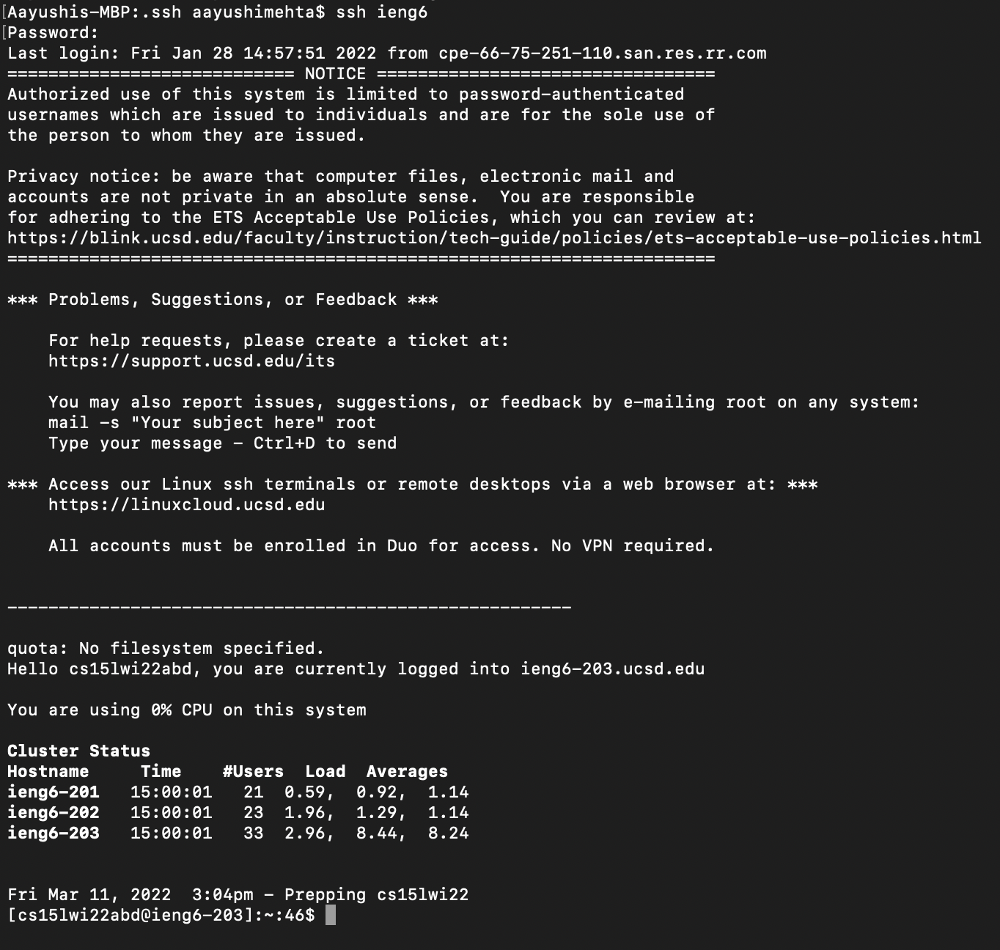
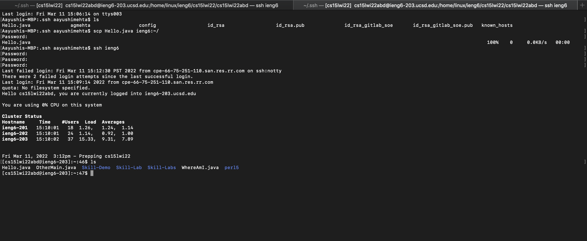

# Group Choice 1- Streamline Configuration

## ```ssh``` File and how I edited it
I edited the file using ```vim``` on Terminal on my mac. 

Commands to access and edit the ```Ssh File```:
1. Open folder: ```cd ~/.ssh```
2. Open/edit file: ```vim config```

On Terminal: 

3. Edit the ```config``` file to contain: 
    ```Host ieng6
        HostName ieng6.ucsd.edu
        User cs15lwi22zzz (use your username)```
        
```Config``` File: 

4. If you want you can change ```ieng6``` after ```Host``` to another name 

## ```ssh``` command to log into account 
1. To login: ```ssh ieng6```
2. Then enter your password

Login: 

## Show scp command to copy file with alias
1. Create a new file on computer: ```vim Hello.java```
2. Then copy it to account: ```scp Hello.java ieng6:~/```
3. log back into account: ```ssh ieng6```
4. Re-enter password
5. Check if file is there: ```ls```

Copy a file: 

