# Aayushi's Lab Report 5
## How to find tests with different results
* I found the tests with different results by using ```diff``` on terminal. I used the command ```diff cse15l-markdown-parse/markdown-parse/result.txt you-markdown-parse/markdown-parse/result.txt``` which outputed all the differences between the two result files. 
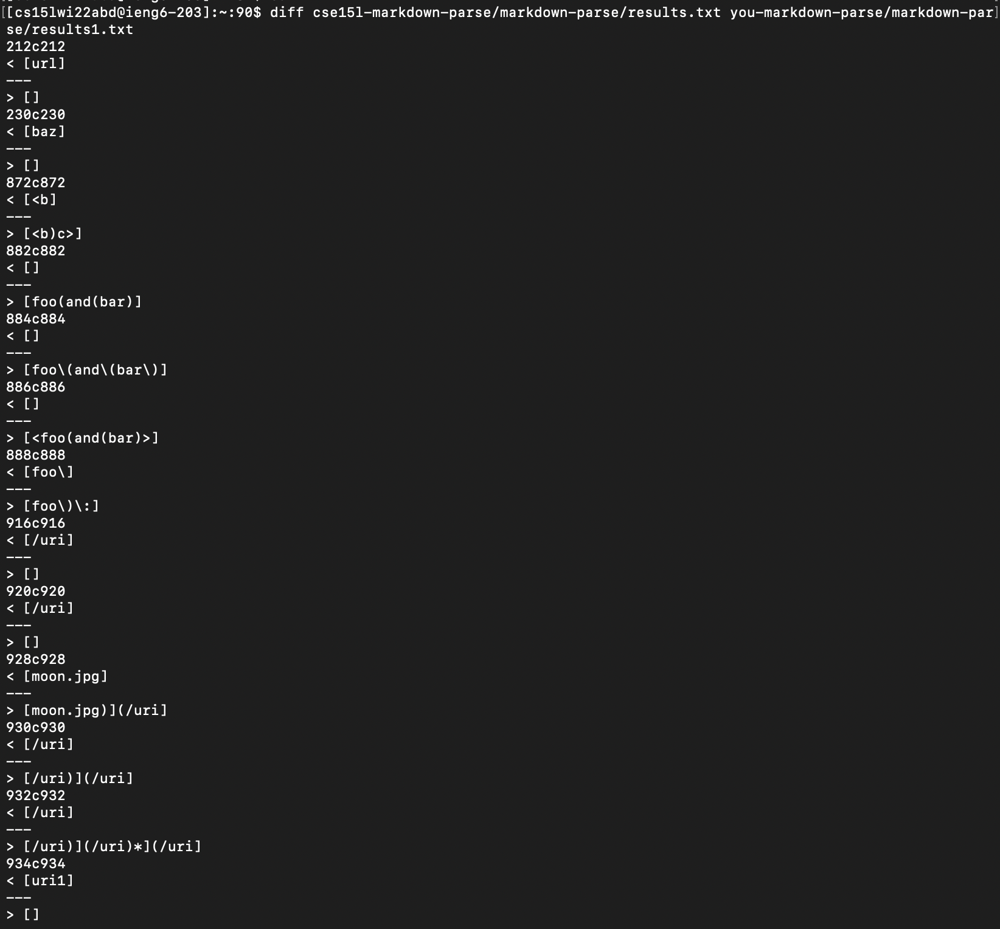
* This gave the lines in the result files to look at. Then in those files I compared the line and was able to see the differences in output. 

## Test 194
I decided to look at test 194
* The code in the file is 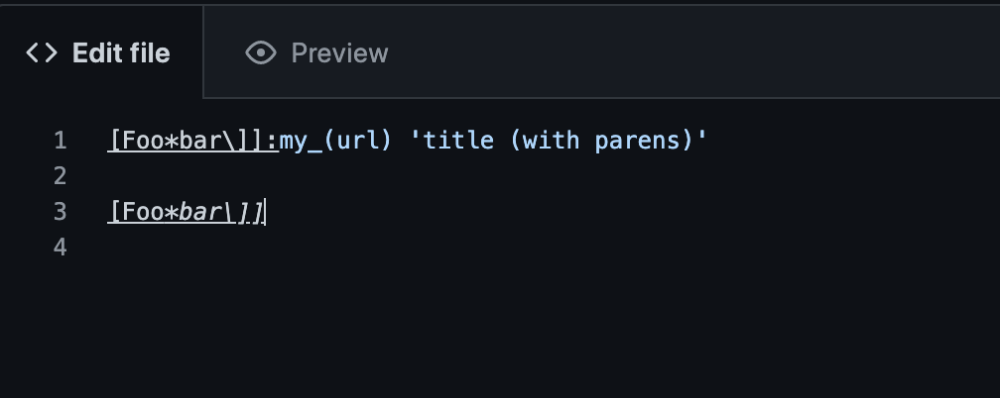
* The output from the given markdown parse was: 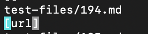
* The output from my markdown parse was: 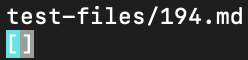
* The expected output was: 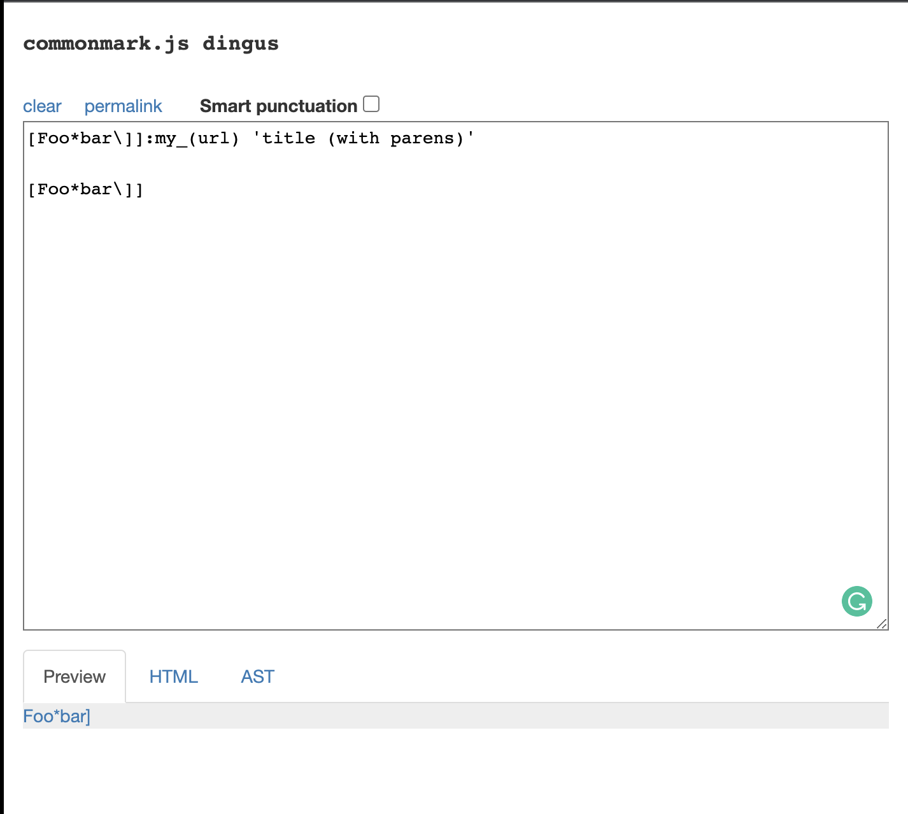
For this one both mine and the professor's outputs were incorrect. The issue in the professor's markdown file is that in the line that starts```String potentialLInk.indexOf``` it checks if something is a link based on open and closed parenthesis. But in this case that incorrectly takes ```url``` as the output. If this part of the code is changed it will fix this error. 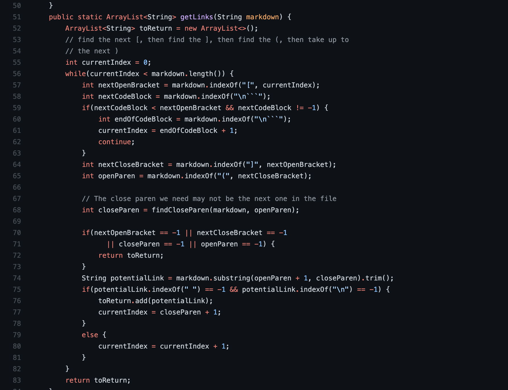


## Test 510
I decided to look at test 510
* The code in the file is 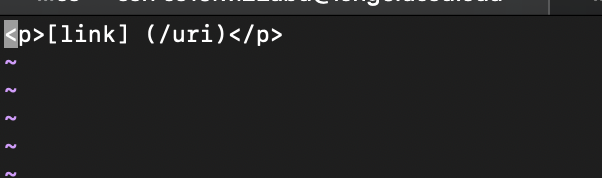
* The output from the given markdown parse was: 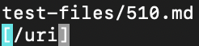
* The output from my markdown parse was: 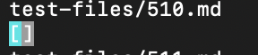
* The expected output was: 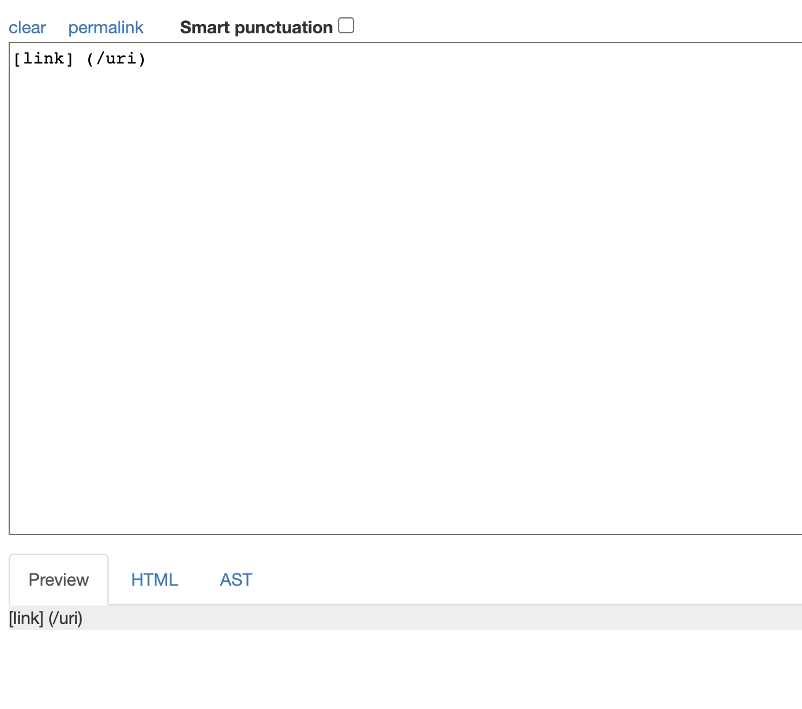
For this one again both mine and the professor's outputs were incorrect. The issue in the professor's markdown file is that since there is a space between ```[link]``` and ```(/uri)``` it shouldn't recognize it as a link as shown in the expected image. In the professor's it instead only prints out what is in the parenthesis. So in the line ``` int nextCloseBracket = markdown``` and the line below it should account for whether there is a space. It should also print what is in the bracket's if it is not a link. 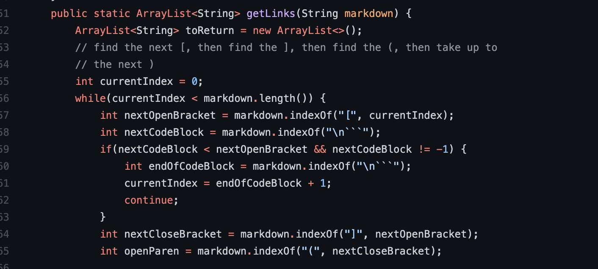
