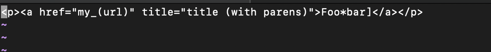
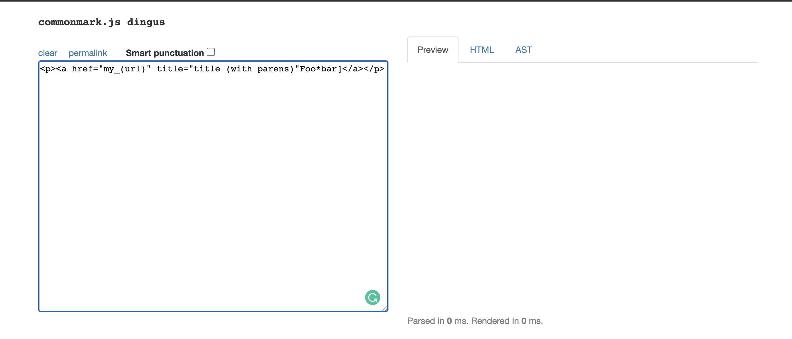
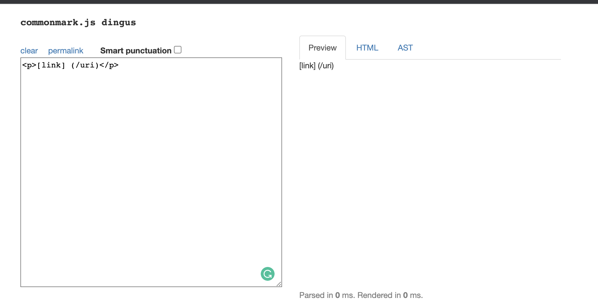

# Aayushi's Lab Report 5
## How to find tests with different results
* I found the tests with different results by using ```diff``` on terminal. I used the command ```diff cse15l-markdown-parse/markdown-parse/result.txt you-markdown-parse/markdown-parse/result.txt``` which outputed all the differences between the two result files. 

* This gave the lines in the result files to look at. Then in those files I compared the line and was able to see the differences in output. 

## Test 194
I decided to look at test 194
* The code in the file is 
* The output from the given markdown parse was: 
* The output from my markdown parse was: 
* The expected output was: 


## Test 510
I decided to look at test 510
* The code in the file is 
* The output from the given markdown parse was: 
* The output from my markdown parse was: 
* The expected output was: 
